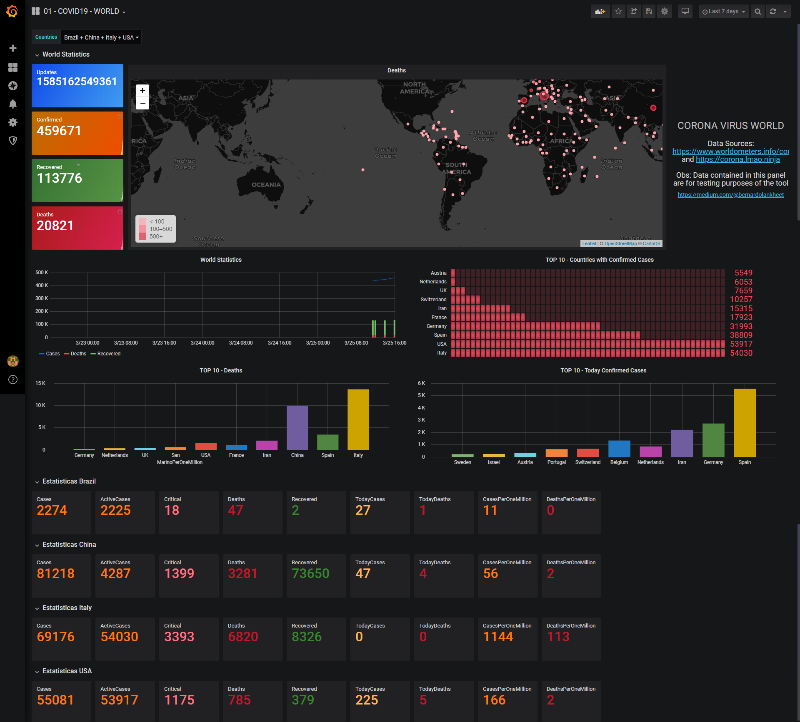

# ZBX-GRA-COVID19
Template_Module_HTTP_LLD_W_Corona and Grafana Dashboard

Zabbix Share: https://share.zabbix.com/zabbix-tools-and-utilities/template-module-http-lld-w-covid19

Grafana:https://grafana.com/grafana/dashboards/11987

EN-US

Homologated:

Zabbix 4.2.8, 4.4.4, 4.4.7, and 4.4.8

Grafana 6.6.2, 6.7.1

Required plugins:

1) grafana-worldmap-panel - https://grafana.com/grafana/plugins/grafana-worldmap-panel
2) alexanderzobnin-zabbix-app - https://grafana.com/grafana/plugins/alexanderzobnin-zabbix-app

Import Template_Module_HTTP_LLD_W_Corona into Zabbix, including any hosts

Wait for data collection, or use the function "Check now" on the 3 HTTP Agents

Import the Dashboard in Grafana

When importing the Template into Garfana, select your Data Source.

Note: It may take some time before Grafana starts to display things.
If the list does not appear in countries, check if the applications and items were generated in Zabbix.

Macros:

- {$HISTORYSP}: History storage period

- {$INTERVALHTTP}: Update interval

- {$INTERVALLLDHTTP}: Update interval HTTP Item LLD

- {$LOSTPERIOD}: Time until the item is removed if there's no data

- {$HTTP_PROXY}: Proxy server to use for the HTTP Agent

- {$TRENDSP}: Trend storage period

- {$UPINTERVALLLD}: Update interval Item LLD

PT-BR

Homologado: 

Zabbix 4.2.8, 4.4.4 e 4.4.7

Grafana 6.6.2

Plugins necessarios: 

1) grafana-worldmap-panel  - https://grafana.com/grafana/plugins/grafana-worldmap-panel
2) alexanderzobnin-zabbix-app - https://grafana.com/grafana/plugins/alexanderzobnin-zabbix-app

Importe o Template_Module_HTTP_LLD_W_Corona para o Zabbix 

Crie um host com nome "CORONA-COVID19", pode usar interface local (127.0.0.1: 10050) e o Hostgroup use o nome "CORONAVIRUS" e vincule o template ao host. 

Aguarde coleta de dados, ou utilize a função "Check now" no item e no LLD para agilizar a coleta

Importe a Dashboard no Grafana

Ao importar o Template para o Garfana, selecione seu Data Source.

Obs: Caso em paises não apareça a lista, verifique se as aplicações e itens foram gerados no Zabbix.

Macros:

- {$HISTORYSP}: History storage period

- {$INTERVALHTTP}: Update interval

- {$INTERVALLLDHTTP}: Update interval HTTP Item LLD

- {$LOSTPERIOD}:

- {$TRENDSP}: Trend storage period

- {$UPINTERVALLLD}: Update interval Item LLD

